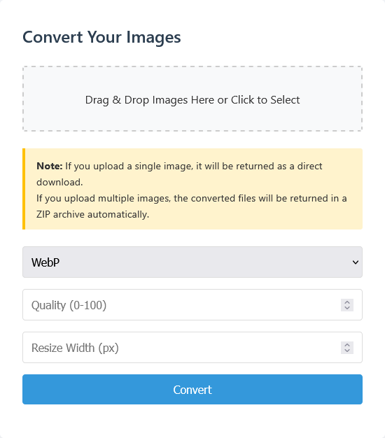

# Image Converter

A lightweight, privacy-focused web application for developers who need quick image conversions without the security concerns of online tools.
This application allows you to convert images between WebP, PNG, JPEG, and GIF formats with optional quality adjustments and resizing—all processed locally on your machine. 

I built this tool to make my own life easier - eliminating the time-consuming process of image conversion while keeping sensitive assets away from third-party web services that may compromise data privacy. 



## Features

- Convert images to WebP, PNG, JPEG, or GIF formats
- Adjust quality settings (0-100)
- Resize images by specifying width
- Drag-and-drop interface for easy file uploads
- Handles both single and multiple image conversions
- Automatically packages multiple images into a ZIP file

## Installation

### Prerequisites

- Node.js
- npm or yarn

### Setup

1. Clone the repository:
   ```bash
   git clone https://github.com/leverh/image-converter
   cd image-converter
   ```

2. Install dependencies:
   ```bash
   npm install
   ```

3. Start the server:
   ```bash
   npm start
   ```

4. Open your browser and navigate to:
   ```
   http://localhost:3000
   ```

## Dependencies

This project uses the following libraries:

- **Express**: Web server framework
- **Multer**: File upload handling
- **Sharp**: Image processing
- **JSZip**: ZIP file creation for multiple image downloads

## Project Structure

```
image-converter/
├── public/                  # Static assets
│   ├── index.html           # Main HTML file
│   ├── styles.css           # CSS styles
│   └── app.js               # Frontend JavaScript
├── server.js                # Express server setup
├── imageConversion.js       # Image processing logic
└── package.json             # Project metadata and dependencies
```

## API

The application exposes a single API endpoint:

### POST /convert

Converts uploaded images to the specified format.

**Request Parameters:**
- `images`: One or more image files (form-data)
- `format`: Output format (`webp`, `png`, `jpeg`, or `gif`)
- `quality`: Output quality (0-100, defaults to 80)
- `width`: New width in pixels (optional)

**Response:**
- For single image: The converted image file
- For multiple images: A ZIP archive containing all converted images

## Development

### Modifying the Frontend

The frontend code is located in the `public` directory:
- Edit `index.html` to modify the structure
- Edit `styles.css` to change the appearance
- Edit `app.js` to modify the frontend behavior

### Modifying the Backend

- `server.js`: Main server setup and request handling
- `imageConversion.js`: Image processing logic

## License

MIT License

